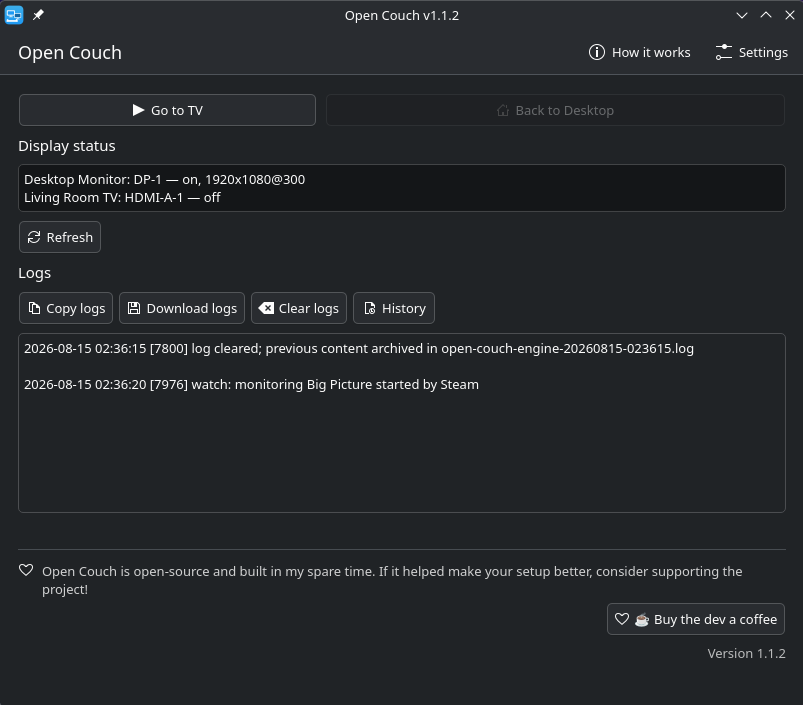

# 🛋️ Open Couch

[](LICENSE)
[](https://github.com/GustavoBelo/OpenCouch/releases)
[](https://flathub.org/apps/details/io.github.gustavobelo.opencouch)

**Open Couch** is a lightweight KDE utility designed for gamers who share a single PC between a traditional desk setup and a living room TV. 

Whether you are running a standard KDE Plasma desktop or an immutable gaming distribution, Open Couch remembers your display layouts (resolution, scale, position). With a single click, it switches to your "living room" layout, launches Steam in Big Picture mode, and automatically restores your original desktop workspace the moment you close Steam.


## ✨ Features

- **Guided Setup:** Easily detect and configure your desktop and TV display outputs.
- **Seamless Switching:** One-click transition between your desk and couch/TV layouts.
- **Steam Integration:** Automatically launches and monitors Steam Big Picture mode.
- **Smart Restore:** Brings your original layout back exactly as it was when Steam closes.
- **Unobtrusive:** Lives in your system tray with live status and log viewing.

## 📸 Screenshots



## 📦 Installation

Open Couch consists of two parts: a sandboxed GUI (Flatpak) and a lightweight bash engine that runs on the host to control `kscreen-doctor` and Steam.

### 1. GUI (Flatpak)

Install the app from [Flathub](https://flathub.org/apps/details/io.github.gustavobelo.opencouch):

```sh
flatpak install flathub io.github.gustavobelo.opencouch

```

Update to new versions with `flatpak update`.

### 2. Host Engine

The engine must run outside the sandbox to manage display layouts and system processes. Install it with the same one-liner offered by the app onboarding:

```sh
bash <(curl -fsSL https://raw.githubusercontent.com/GustavoBelo/OpenCouch/main/packaging/host/install.sh)

```

Or, from a checkout of this repository:

```sh
# Install for the current user (no sudo required)
./packaging/host/install.sh

# OR install system-wide
sudo ./packaging/host/install.sh --system

# Force a reinstall (e.g. after the engine is updated)
./packaging/host/install.sh --update

```

The installer downloads the engine scripts with SHA256 checksum verification and checks for missing dependencies (`jq`, `kscreen-doctor`, `pgrep`; `wmctrl` is optional but recommended), suggesting the right packages for your distribution (Fedora, Debian/Ubuntu, Arch). When the app is already installed, it detects it and tells you to simply restart it.

On Bazzite or other `ujust`-based systems, copy `packaging/host/open-couch.just` to `/etc/just/ujust.d/` and use:

```sh
ujust install-open-couch   # install the engine
ujust update-open-couch    # update it
ujust remove-open-couch    # remove it

```

### 3. Alternative: Install from a bundle

Instead of Flathub, download the latest `OpenCouch.flatpak` bundle from the [Releases page](https://github.com/GustavoBelo/OpenCouch/releases) and install it directly:

```sh
flatpak install OpenCouch.flatpak

```

To build the bundle yourself:

```sh
./packaging/build-flatpak.sh
flatpak install --user OpenCouch.flatpak

```

## 🛠️ Development

Open Couch is built with Qt 6 and Kirigami (C++17 + QML). To build natively for development:

**Requirements:** Qt 6 (Core, Gui, Widgets, Qml, Quick, QuickControls2, LinguistTools), KDE Frameworks 6 Kirigami, Extra CMake Modules (ECM), CMake >= 3.16.

```sh
cmake -S app -B app-build -DCMAKE_BUILD_TYPE=Release
cmake --build app-build
./app-build/opencouch

```

Versioning is driven by git tags (`vX.Y.Z`). To create a new release and trigger the GitHub Actions CI (which builds the bundle and generates release notes):

```sh
./packaging/release.sh 1.1.2

```

This script ensures the fallback `app/version.txt` stays in sync with the git tag, validates the AppStream metainfo, and creates the commit/tag. Pushing the tag will automatically publish the GitHub Release with the Flatpak bundle attached.

## 📂 Repository Structure

* `app/` — Qt 6 / Kirigami GUI (C++17 sources, QML, translations).
* `backend/` — `open-couch-engine` (display/Steam control script) + log viewer.
* `packaging/` — Flatpak manifest, metainfo, desktop entry, icons, and host installer (`install.sh` + ujust recipes).

## 📄 License

This project is licensed under the [GPL-3.0-or-later](https://www.google.com/search?q=LICENSE) License.
