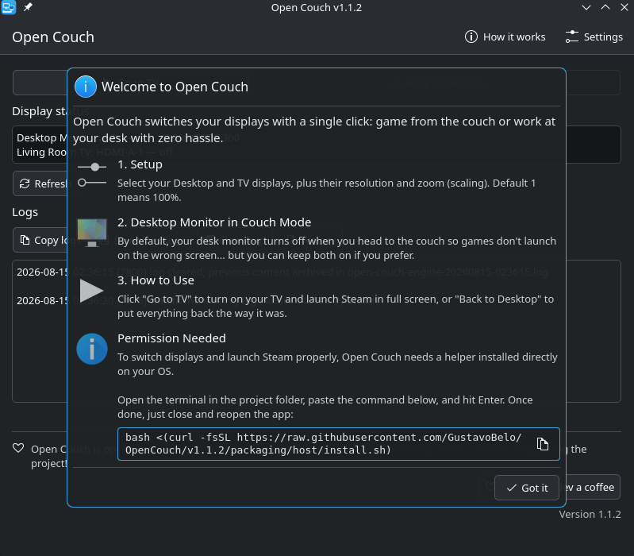
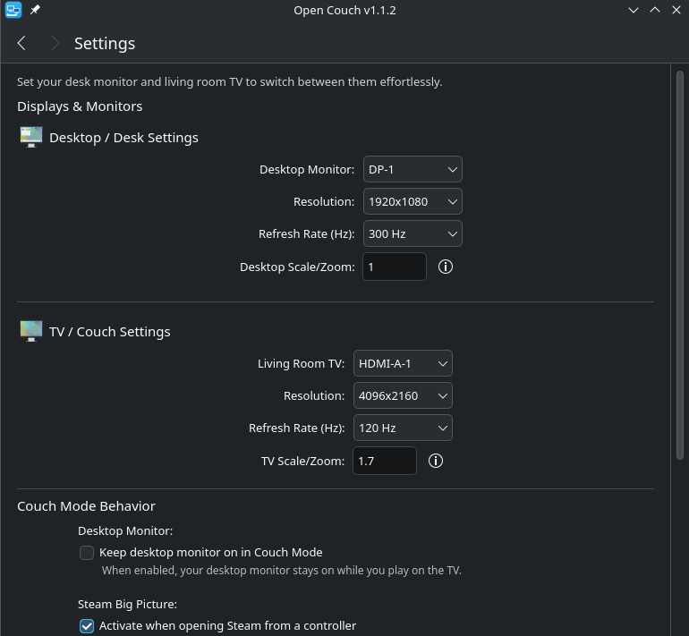
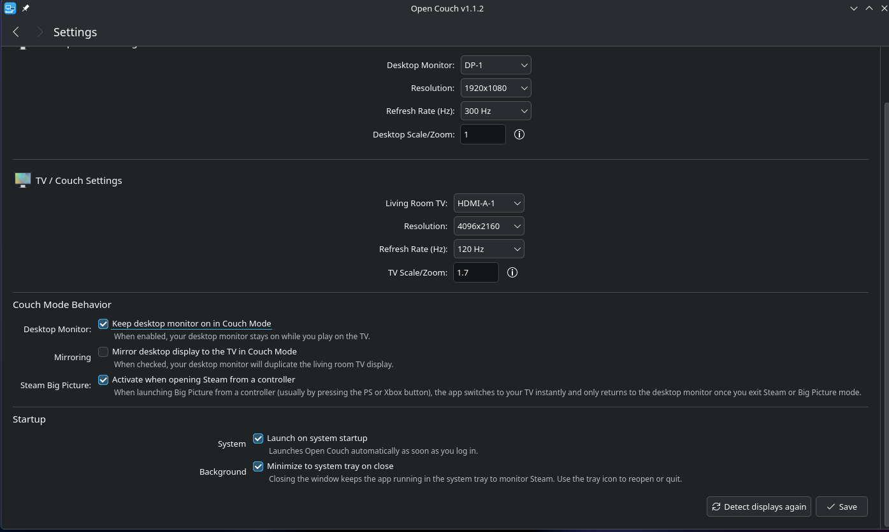

# 🛋️ Open Couch

[](LICENSE)
[](https://github.com/GustavoBelo/OpenCouch/releases)
[](https://flathub.org/apps/details/io.github.gustavobelo.opencouch)

**Open Couch** is a Linux app that switches your display setup when you want to game on the living room TV - and restores everything when you're done, automatically.

If you have a PC at your desk but sometimes want to kick back on the couch with a controller, this app is for you.

---

## ✨ What it does

| | |
|---|---|
| **One-click display switch** | Click "Go to TV" and your PC turns off the desk monitor, enables the TV at the right resolution, and opens Steam in Big Picture mode (full-screen, controller-friendly). |
| **Automatically restores when you're done** | Closed Steam? Open Couch detects that and puts everything back - monitor on, normal resolution, correct scale. |
| **Stays out of the way** | The app lives in the system tray (that small corner with icons near the clock). Open it only when you need it. |
| **Set up once, use forever** | On first run, you pick which is your monitor and which is your TV. After that, it's just one click. |

---

## 📸 App screenshots

**Main screen** - everything you need, right here:


**Welcome** - first-run walkthrough:



**Settings** - pick your displays once:





## 📦 Installation

Open Couch has two parts that need to be installed: the app and a small system helper.

> **Why two parts?**
> The app runs inside a secure sandbox so it can't access your system unnecessarily. But to actually control your displays and Steam, it needs a small helper that runs outside that sandbox. Think of it like a banking app that needs a separate card reader.

---

### Step 1 - Install the app (AppImage recommended)

The AppImage is the recommended option for Open Couch because it works more directly
with the system helper that controls your displays and Steam. Download
`OpenCouch-x86_64.AppImage` from the [GitHub Releases page](https://github.com/GustavoBelo/OpenCouch/releases), make it executable, and run it:

```sh
chmod +x OpenCouch-x86_64.AppImage
./OpenCouch-x86_64.AppImage
```

#### Alternative: Flatpak via Flathub

The Flatpak is available through [Flathub](https://flathub.org/apps/details/io.github.gustavobelo.opencouch). It is more sandboxed, but still requires the same system helper below:

```sh
flatpak install flathub io.github.gustavobelo.opencouch

```

To update later: `flatpak update`.

---

### Step 2 - Install the system helper (required)

Both the AppImage and Flatpak require this helper because it runs outside the app sandbox
and controls your displays and Steam. Open a terminal and paste the command below. The app
also shows this command on the welcome screen:

```sh
bash <(curl -fsSL https://raw.githubusercontent.com/GustavoBelo/OpenCouch/main/packaging/host/install.sh)

```

The installer will:

* Check that your system has everything required
* Install the helper that controls your displays and Steam
* Let you know if anything is missing and suggest how to fix it

After it finishes, close and reopen Open Couch.

---

### Using Bazzite or a system with `ujust`?

Copy `packaging/host/open-couch.just` to `/etc/just/ujust.d/` and use:

```sh
ujust install-open-couch   # install
ujust update-open-couch    # update
ujust remove-open-couch    # remove

```

---

## 🚀 Getting started

After installing both components:

1. **Open Open Couch** - it will appear in your desktop or app menu.
2. **Follow the initial setup** - the app will detect your displays automatically. Choose which is your desk monitor and which is your TV.
3. **Click "Go to TV"** - the app will adjust your displays and open Steam.
4. **Play away** - when you close Steam, everything goes back to normal on its own.

> 💡 **Tip:** Enable "Start with the system" in settings so Open Couch is already in the tray every time you boot your PC.

---

## ❓ Frequently asked questions

**Does it work with any Linux distribution?**
It works on distributions with KDE Plasma (such as Fedora KDE, Kubuntu, KDE Neon, Bazzite, and similar). It does not work with GNOME or other desktop environments.

**Do I need Steam installed?**
Yes, Steam must be installed on your system for the Big Picture integration to work. You can disable this in settings if you prefer - the app will switch displays without launching Steam.

**Will my desk monitor turn off while gaming on the TV?**
By default, yes - this prevents games from launching on the wrong screen. In settings you can enable "Keep desk monitor on" if you prefer both displays active at the same time.

**The app didn't detect my TV or monitor. What do I do?**
Make sure the TV is on and connected before opening the app. On the settings page, click "Detect again" to try once more.

**How do I remove the system helper?**
Run in a terminal:

```sh
bash <(curl -fsSL https://raw.githubusercontent.com/GustavoBelo/OpenCouch/main/packaging/host/install.sh) --remove

```

**The app is in the tray but I can't open it.**
Right-click the tray icon and choose "Show".

---

## 📄 License

This project is licensed under [GPL-3.0-or-later](https://www.google.com/search?q=LICENSE).

---

### Building from source

Open Couch uses Qt 6 and Kirigami (C++17 + QML) for the interface, and a Bash script as the display/Steam control engine.

**Dependencies:** Qt 6 (Core, Gui, Widgets, Qml, Quick, QuickControls2, LinguistTools), KDE Frameworks 6 Kirigami, Extra CMake Modules (ECM), CMake >= 3.16.

```sh
cmake -S app -B app-build -DCMAKE_BUILD_TYPE=Release
cmake --build app-build
./app-build/opencouch

```

### Repository structure

* `app/` - Qt 6 / Kirigami GUI (C++17 sources, QML, translations)
* `backend/` - `open-couch-engine` (display and Steam control script) + log viewer
* `packaging/` - Flatpak manifest, metainfo, desktop entry, icons, and host installer (`install.sh` + ujust recipes)

### Creating a release

Versioning is done via git tags (`vX.Y.Z`). To create a new release and trigger the GitHub Actions CI:

```sh
./packaging/release.sh 1.1.2

```

This script syncs `app/version.txt` with the git tag, validates the AppStream metainfo, and creates the commit/tag. Pushing the tag automatically publishes a GitHub Release with the AppImage attached. Flatpak releases are distributed through Flathub.